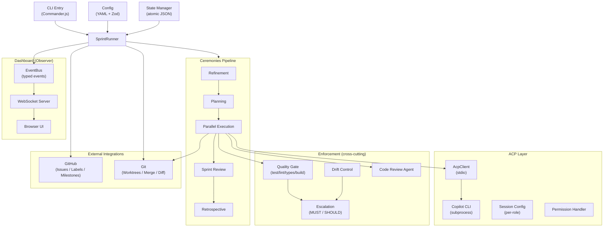
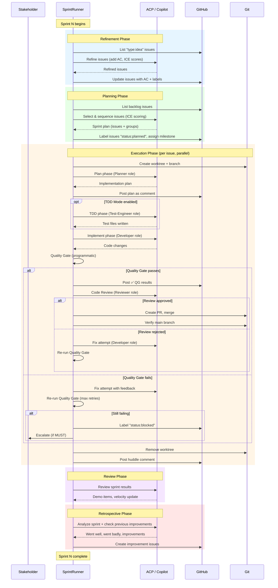
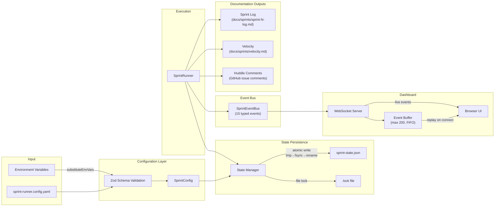

# Architecture & Flow Diagrams

Visual diagrams complementing the text-based documentation in [OVERVIEW.md](../OVERVIEW.md).

---

## 1. High-Level Architecture

---

## 2. Sprint Lifecycle Sequence

---

## 3. Data Flow

